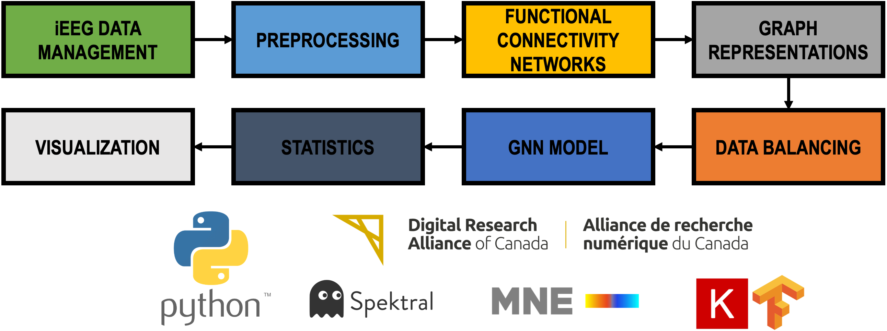

# bgreg: brain graph representations generator

This project proposes a framework for creating network and graph representations from electroencephalographic (EEG) recordings. It includes an explainability module to generate and process Learnable Importance MEtric (LIME) scores.

An overview of the pipeline functionality has been published in Díaz-Montiel AA, Zhang R, Lankarany M. Optimal graph representations and neural networks for multichannel time series data in seizure phase classification. Scientific Reports. 2025 Jun 4;15(1):19552. https://doi.org/10.1038/s41598-025-01882-7

## Pipeline

Other research initiatives can be found under the projects directory.

## Support
For questions please contact Dr. Milad Lankarany at: 

milad [dot] lankarany [at] uhn [dot] ca

## Authors and acknowledgment
Dr. Alan A. Díaz Montiel

Richard Zhang

Dr. Milad Lankarany

David Crompton

&nbsp;

Past contributors:

Serena Liu (_undergraduate intern_, Summer 2022)

Darius Nguyen (_undergraduate intern_, Winter 2022)

## License
TBD
