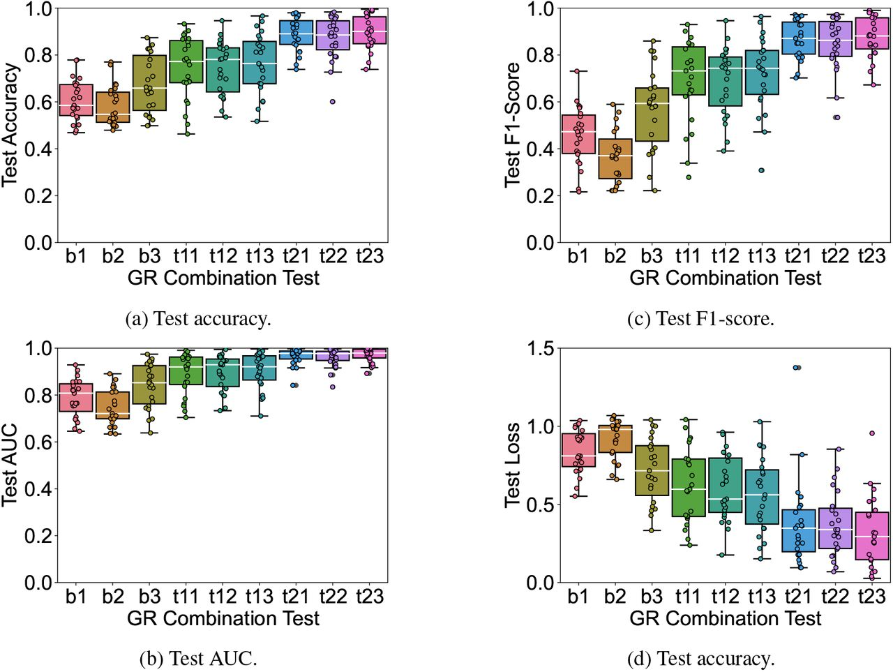

This project has been defined in:

Díaz-Montiel, Alan A., and Milad Lankarany. "Graph representations of iEEG data for seizure detection with graph neural networks." bioRxiv (2023): 2023-06. https://www.biorxiv.org/content/10.1101/2023.06.02.543277v1

Example of an iEEG run from one patient illustrating the preictal, ictal, and postictal signal periods, divided by the seizure onset and seizure offset clinical markers in red and blue, respectively. Figure generated with MNE.

Diagram illustrating our data pipeline. The tool is entirely developed in Python, and it is powered by MNE for iEEG data management and preprocessing, Spektral and Keras with Tensorflow for data balancing and GNN model handling, and it is running on the Canada wide High Performance Computing platform managed by the Digital Research Alliance of Canada.

Methodology to create functional connectivity networks (FCNs). A. Every iEEG record (each run) of duration L has 2 main time marks, the seizure onset (t_on) and the seizure offset (t_off). The signal trace within t0 and t_on indicates the preictal period of the signal, which we label as 0 for the binary and multi-class classification problems. The signal trace within t_on and t_off indicates the ictal period, which we label as 1 for the binary and multi-class classification problems. The signal trace within t_off and L indicates the postictal period, which we label as 0 and 2 for the binary and multi-class classification problems, respectively. To create FCNs, we declare a window W (in green, top-left) that indicates the portion of the iEEG record to analyze. Then, we declare a sliding window SW (in blue, top-center) that indicates how to slide W over the entire record. B. Illustration of 4 FCNs sequentially created by sliding W by SW. C. The result is a multidimensional array shaped by (e, e, L − SW + 1), representing an FCN sequence.

Illustration of graph representations (GRs). A. G = A = (V, E) is the original graph represented as a set of vertices V and edges E. B. GR = (A, V, E) is a graph representation with 3 elements: and adjacency matrix, AV ×V, a node features vector, V V ×M, and an edge features vector, EV ×N, where M and N are the number of node and edge features, respectively. C. Similar to the FCN sequences, we can create sequences of GRs.

Illustration of the data balancing procedure.

Architecture of the GNN model proposed by Grattarola et. at. from paper.

Test results performance for the binary classification seizure detection problem.

Test results performance for the multi-class classification seizure detection problem.
